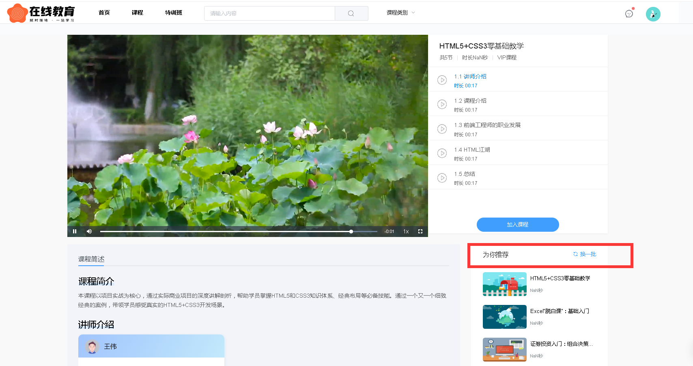

## SpringBoot+Vue.js在线教育平台 在线学习平台

## 要求
源码一套有偿(论文 开题报告  文献综述  源码+sql脚本)
加好友前帮忙start一下，并备注github有偿获取源码
我的QQ号是2877135669或者2827724252
加qq好友说明（被部分 网友整得心力交瘁）：
    1.加好友务必按照格式备注
    2.避免浪费各自的时间！
    3.当“客服”不容易，repo 主是体面人，不爆粗，性格好，文明人。

​    https://www.bilibili.com/video/BV1gM4y1L7Yc?spm_id_from=333.999.0.0

# 资料截图

## 功能

用户学习平台共分为九大模块，包括课程预告、在线课程观看、学习资料下载、学习文章预览、线下班报名、用户消息通知、个人信息管理、
                             VIP详情介绍、客服和签到系统等模块；
后台管理系统共分为七大模块，包括人事管理、课程管理、学习资料管理、锦囊管理、营销管理、订单管理、系统审核等模块；
创新点：
①基于阿里云短信平台完成手机号变更[短信验证码]
②基于支付宝沙箱支付完成在线购买课程[在线支付]
③基于apach-echarts完成图表统计分析[可视化]
④基于第三方websocket通讯插件完成在线客服功能[即时聊天]
⑤api端+后台web管理系统+前端页面[saas架构]
⑥纯正前后端分离，比较罕见(非所谓的jsp+vue.js形式做前端+springboot后端的‘伪’前后端分离)
⑦JavaMail邮件通知[购买课程成功推送邮件提醒]
⑧基于时间完成最新课程推荐[推荐功能]

## 

# 特点

1、积累丰富实战经验，可以写进简历进行面试。
2、完成程序设计课程，得到优秀。
3、学习软件开发流行架构，并且熟悉常规代码套路，积累模板代码。

​	

# 运行截图

# 运行视频(B站
https://www.bilibili.com/video/BV1gM4y1L7Yc?spm_id_from=333.999.0.0

